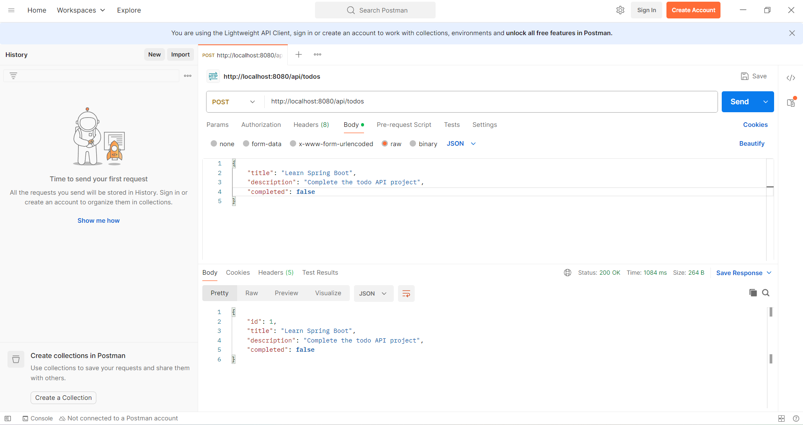
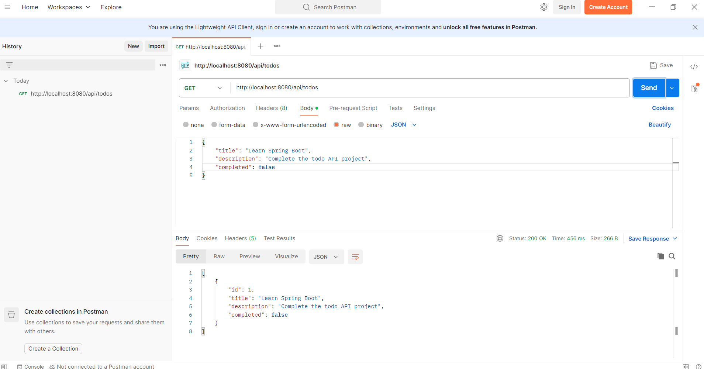
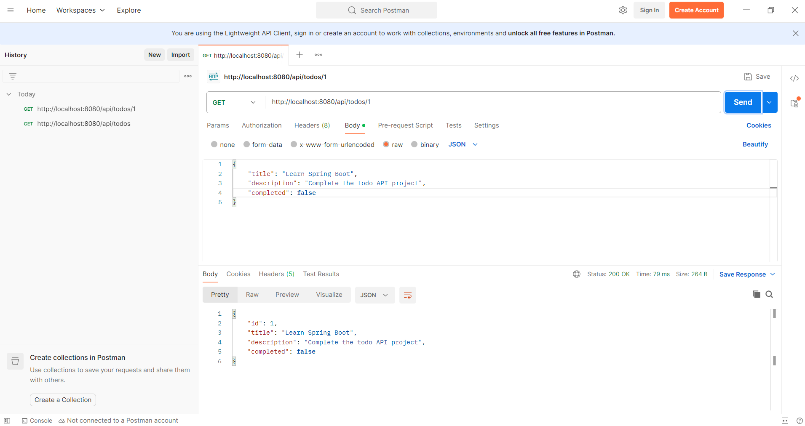
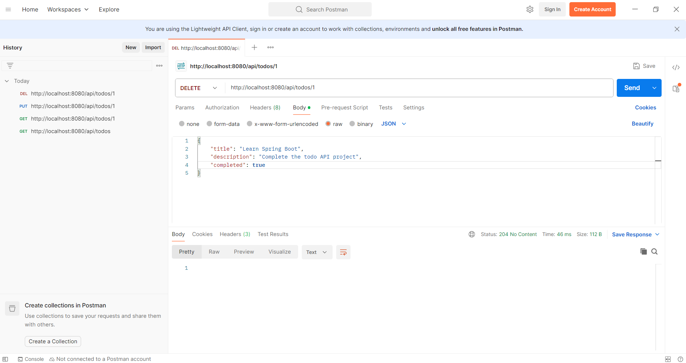

# 📝 Todo REST API

A RESTful API built with Spring Boot to manage todo tasks, developed as part of a Java backend portfolio for learning purposes.

## Features
- Create, read, update and delete todos (full CRUD)
- RESTful endpoints following REST conventions
- Persistent storage via H2 in-memory database
- Layered MVC architecture

## Technologies
- Java 21
- Spring Boot 3.5.13
- Spring Data JPA
- H2 Database
- Maven
- Git & GitHub

## Agile Process
This project was developed following the **Scrum framework**:
- Work organized in a Sprint with a defined Sprint Goal
- User stories tracked in the Product Backlog
- Daily standup log maintained throughout development
- Sprint concluded with a Review and Retrospective

> Developer holds a Professional Scrum Master I (PSM I) certification issued by Scrum.org

## Architecture

controller  → receives HTTP requests

service     → applies business logic

repository  → talks to the database

model       → data structure

## API Endpoints

| Method | URL | Description |
|---|---|---|
| GET | /api/todos | Get all todos |
| GET | /api/todos/{id} | Get todo by ID |
| POST | /api/todos | Create new todo |
| PUT | /api/todos/{id} | Update todo |
| DELETE | /api/todos/{id} | Delete todo |

## API Testing with Postman

All endpoints tested and verified with Postman.

### POST — Create a todo


### GET — Retrieve all todos


### GET — Retrieve by ID


### PUT — Update a todo


### DELETE — Delete a todo


## How to Run
1. Clone the repository
   git clone https://github.com/melmaur/todo-api
2. Open the project in IntelliJ IDEA
3. Run TodoApiApplication.java
4. API available at http://localhost:8080/api/todos
5. H2 console available at http://localhost:8080/h2-console


## 🐳 Docker Support

The application has been containerized using Docker as part of Sprint 2.

### Run with Docker

1. Build the image:
```bash
   docker build -t todo-api .
```

2. Run the container:
```bash
   docker run -p 8080:8080 todo-api
```

3. API available at: `http://localhost:8080/api/todos`
4. H2 console at: `http://localhost:8080/h2-console`

### What changes with Docker

Previously the application required IntelliJ and a local Java 21 
installation to run. With Docker, the container includes everything 
needed — the app runs in an isolated environment with no local 
dependencies required.

## Project Structure
```
src/main/java/
├── controller/    → TodoController.java
├── model/         → Todo.java
├── repository/    → TodoRepository.java
├── service/       → TodoService.java
└── todo_api/      → TodoApiApplication.java
```
